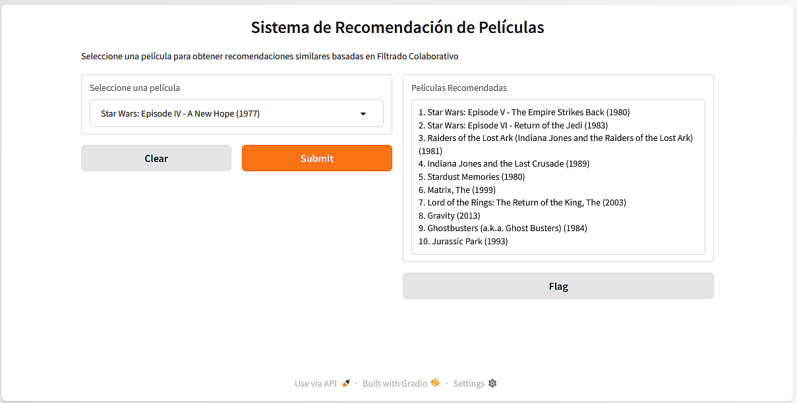

# Movie Recommendation System
## Interactive public dashboard for a Movie Recommendation System with gradio interface.


### Movie Recommendation System

The script uses item-item collaborative filtering with centered cosine similarity. 
It processes ratings data to account for user rating biases. It uses efficient
similarity computation using scikit-learn. It uses an interactive dropdown interface
with Gradio. And it handles sparse data through mean-centering.

### Python code:

### 1. Import libraries
```
import pandas as pd
import gradio as gr
from sklearn.metrics.pairwise import cosine_similarity
```
### 2. Load and preprocess data
```
movies = pd.read_csv("movies.csv")
ratings = pd.read_csv("ratings.csv")
```
### 3. Create item-item similarity matrix using collaborative filtering
```
merged_data = ratings.merge(movies, on='movieId')
```
### 4. Create user-item matrix with mean-centered ratings
```
mean_ratings = merged_data.groupby('movieId')['rating'].mean()
merged_data['centered_rating'] = merged_data.apply(
    lambda row: row['rating'] - mean_ratings[row['movieId']], axis=1
)
user_item_matrix = merged_data.pivot_table(
    index='movieId', 
    columns='userId', 
    values='centered_rating', 
    fill_value=0
)
```
### 5. Compute cosine similarity between movies
```
cosine_sim = cosine_similarity(user_item_matrix)
cosine_sim_df = pd.DataFrame(
    cosine_sim,
    index=user_item_matrix.index,
    columns=user_item_matrix.index
)
```
### 6. Recommendation function
```
def recommend_movies(movie_title):
    try:
        movie_id = movies.loc[movies['title'] == movie_title, 'movieId'].iloc[0]
        sim_scores = cosine_sim_df[movie_id].sort_values(ascending=False).head(11)
        sim_scores = sim_scores.drop(movie_id).head(10)
        recommended_movies = movies.set_index('movieId').loc[sim_scores.index]['title']
        return "\n".join(f"{i+1}. {movie}" for i, movie in enumerate(recommended_movies))
    except:
        return "Película que no encontrada en la base de datos"
```
### 7. Create Gradio interface
```
interface = gr.Interface(
    fn=recommend_movies,
    inputs=gr.Dropdown(
        choices=movies['title'].unique().tolist(),
        label="Seleccione una película"),
    outputs=gr.Textbox(label="Películas Recomendadas"),
    title="Sistema de Recomendación de Películas",
    description="Seleccione una película para obtener recomendaciones similares basadas en Filtrado Colaborativo"
)

interface.launch()
```


